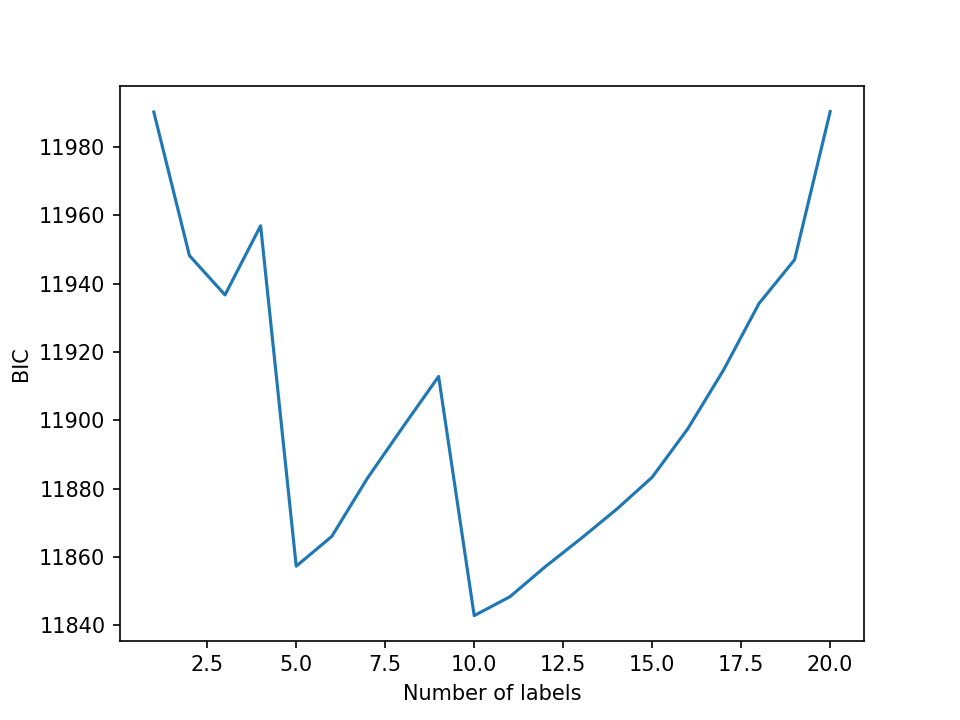
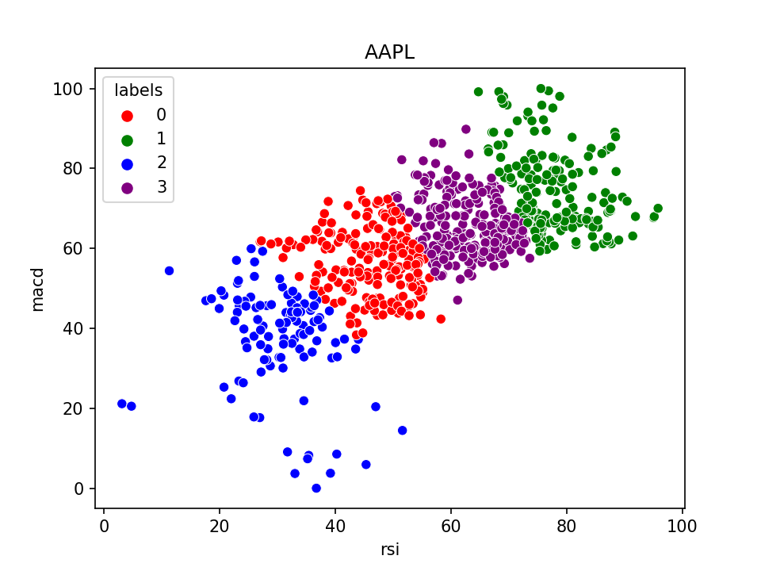

# StockAnalysisWGmm
This project was built to test the plausubility of categorizing stock prices into oversold and overbought ranges using gaussian mixture models. A basic strategy to use with this model would be to buy a stock in the low oversold range and sell a stock in the high overbought range.

To avoid having to sort through price histories or build a model to create a trianing dataset an unsupervized model was need, making gaussian models a good fit.    
The SkLearn library was used for the gaussian mixture model with the RSI and MACD as the X training data. Labels are calculated from the same rsi and macd dataset 
used to train the model. 

To optimize the model a BIC value was calculated for models using 1 to 20 labels and 4 was choosen as the best number of labels. 

The rsi and macd were also plotted with the label catergories highlighted in different colors. It was found that there is no 
clear boundaries for categorizing the data set. The chart also shows that there is a similar covarience between the macd and 
the rsi so 'tied' was used as the covarience type when training the model. Even though there are no clear boundries to caterorize the data I thought the model
was able to seperate the data how I wanted.

Below is a video of the project being used. The project comes with and example data set "test_AAPL". To get data for more stocks access to the TD ameritrade api is required, just add you own CONSUMER_KEY and ACCOUNT_NUMBER into the config file. After setting up the config file type any ticker into the input field in the ui and it will pull in data for that ticker.  

https://user-images.githubusercontent.com/82553480/164945492-cd9ce25f-f170-4ed5-b1f6-fa8754e4d4e0.mp4

